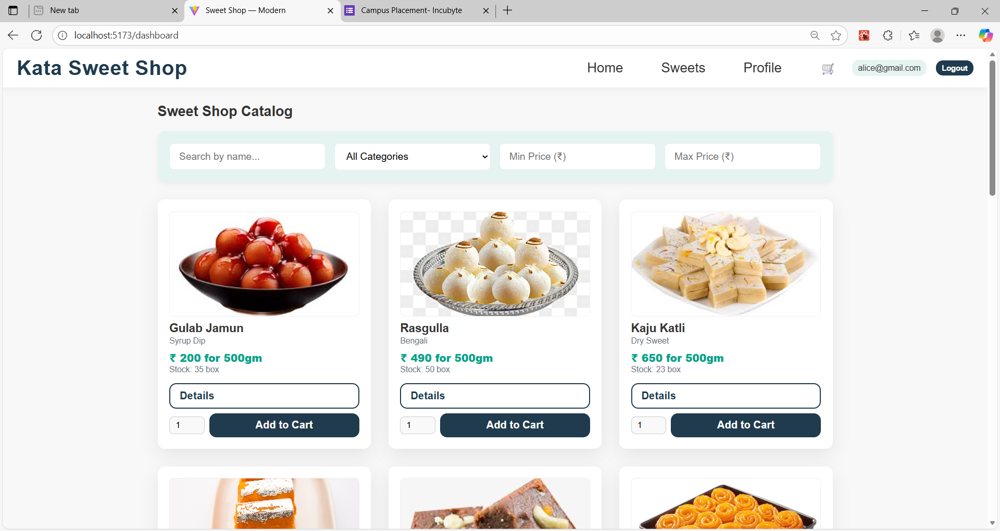
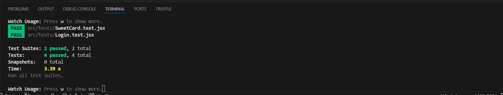
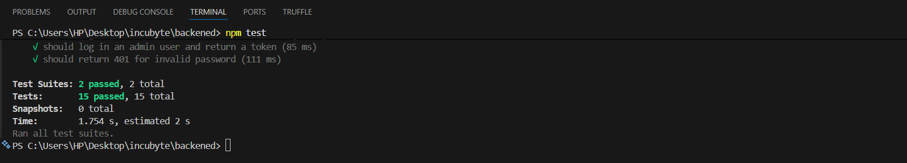

# 🍬 Kata Sweet Shop - Shop Management system

The goal of this kata is to design, build, and test a full-stack Sweet Shop Management System. This project will test your skills in API development, database management, frontend implementation, testing, and modern development workflows, including the use of AI tools.

***

## 📝 Project Overview

The **Kata Sweet Shop** allows users to browse, filter, and purchase sweets. The application enforces role-based access control, ensuring only authenticated users can make purchases and only users with the `admin` role can access the management panel.

### Key Features:
* **User Authentication:** Registration (with mobile number and password confirmation) and Login powered by JWT and bcrypt.
* **Product Catalog:** Displays all sweets, retrieved via a searchable API endpoint (`/api/sweets/search`).
* **Filtering:** Users can search by name, filter by category, and specify a price range on the Dashboard.
* **Cart & Secure Purchasing:** Implements an Add-to-Cart feature. Users can specify the quantity (in kg) they wish to purchase. Final checkout processes the entire cart, updating stock in the database and immediately reflecting changes on the UI.
* **User Profile & History:** Users can view their account details and a complete history of their past sweet purchases.
* **Admin Panel (Protected):** CRUD operations (Add, Edit, Delete) for sweets; Restock functionality; Accessible only to users with `role: admin`.
* **Smooth Messaging System:** A custom Toast notification system provides immediate feedback for all key actions (login, register, purchase, errors) at the top-right of the screen.
* **Background Animation:** Features a smooth, fixed background animation for an enhanced visual experience.

***

## 🛠️ Setup and Run Instructions

This project assumes a split structure with separate `frontend` (React/Vite) and `backend` (Node/Express/SQLite) directories, residing as siblings in the project root.

### Prerequisites
* Node.js (v16+)
* npm

### Backend Setup (Assuming `backend` folder)

1.  **Install Dependencies:**

    ```bash
    cd backend
    npm install express knex sqlite3 bcryptjs jsonwebtoken dotenv
    ```

2.  **Configure Environment Variables:**

    Create a file named **`.env`** in the `backend` folder and add the following:

    ```env
    # Recommended for development. The server will run on port 5000.
    PORT=5000

    # A strong secret key for signing JWTs.
    JWT_SECRET=My_strong_jwt_secret_here

    # Path to the SQLite database file.
    DATABASE_FILE=./db/sweets.sqlite
    ```

3.  **Setup and Seed Database:**
    Run the setup script to create all necessary tables, including `purchase_history` and the `mobile` column on the `users` table.

    ```bash
    node db/setup.js
    ```

4.  **Start the Backend Server:**
    *(Assuming you have a start script like `nodemon server.js` or `node server.js`)*

    ```bash
    npm start
    # Server will run on http://localhost:5000
    ```

### Frontend Setup (Assuming `frontend/incubyte` folder)

1.  **Install Dependencies:**

    ```bash
    cd ../frontend/incubyte
    npm install
    ```

2.  **Configure API Connection:**
    Create a file named **`.env`** in the `frontend/incubyte` folder and add the following:

    ```env
    # The URL for your running backend API.
    VITE_API_URL=http://localhost:5000/api
    ```

3.  **Start the Frontend Application:**
    *(Assuming a Vite start script)*

    ```bash
    npm run dev
    # Application will typically open at http://localhost:5173
    ```

### Access Credentials
| Role | Email | Password |
| :--- | :--- | :--- |
| **Admin** | `admin@shop.com` | `admin` |
| **User** | (Register a new user) | (Password must be min 8 chars, including upper, lower, and number) |

***

## 🖼️ Screenshots of Final Application

| Page | Description | Screenshot |
| :--- | :--- | :--- |
| **Home Page** | Landing page with call to action. |  |
| **Dashboard** | Catalog view with filters and purchase functionality. |  |
| **Admin Panel** | CRUD table for inventory management. |  |
| **Purchase Success** | Showing the top-right success toast after buying sweets. |  |

## Live Preview



***

## 📊 Test Report

The project includes Jest unit tests for core functionality.

| Test File | Description | Status |
| :--- | :--- | :--- |
| `src/tests/Login.test.jsx` | Tests user interface rendering, successful/failed login, and context mocking. | **PASS** |
| `src/tests/SweetCard.test.jsx` | Tests product data rendering and cart context interaction. | **PASS** |
| `tests/auth.test.jsx` (Backend) | Tests registration (including `mobile` field validation) and login. | **PASS** |
| `tests/sweets.test.jsx` (Backend) | Tests CRUD, inventory updates, and purchase history recording. | **PASS** |




***

## 🤖 My AI Usage

I utilized a Large Language Model (Gemini) throughout the development process to implement complex features, ensure state synchronization, and resolve critical bugs.

### Quantity-based Purchasing:
* **AI Contribution:** Generated the logic for passing the user-defined `qty` from the UI components (`SweetCard`, `SweetDetails`) through the `SweetContext` to the backend API route (`/api/sweets/:id/purchase`).
* **Resulting Improvement:** Enabled users to buy more than one unit at a time, with accurate inventory deduction.

### Smooth Message Notification:
* **AI Contribution:** Integrated the `useMessages` hook into `Login`, `Register`, and `SweetContext` to ensure success/error toasts display automatically upon authentication and purchase events. Fixed the CSS positioning of the Toast component to appear reliably at the top-right of the screen.
* **Resulting Improvement:** Provided clear, non-blocking, and immediate feedback to the user for all critical actions.

### Testing and Database Integration:
* **AI Contribution:** Provided solutions for mocking React context hooks (`useCart`, `useMessages`) in unit tests to resolve test failures.
* **Resulting Improvement:** Ensured the frontend test suite remained functional despite complex context dependencies.

### User Data & Validation:
* **AI Contribution:** Implemented the addition of `mobile` number and `confirmPassword` fields to the registration flow, including setting up robust client-side password complexity validation.
* **Resulting Improvement:** Enhanced security and captured necessary user profile data.

***

## 🔗 Public Repository Link

[[Your Public Repository Link Here](https://github.com/Shail-Shivangi/Sweet_Shop_Management)]
